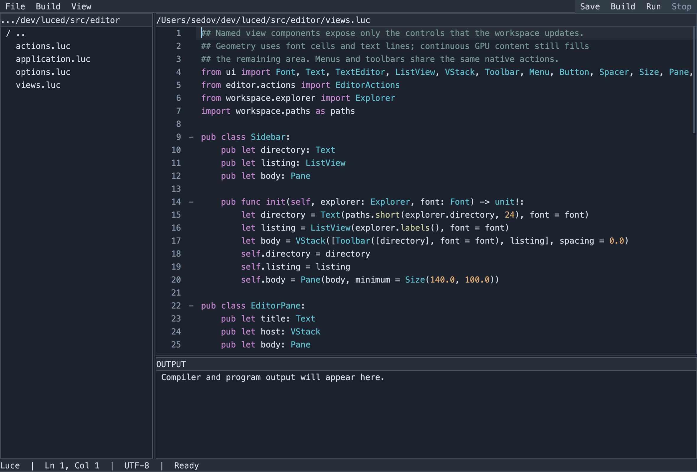

# luced

A small native code editor written in **Luce**, built with the **luce-ui** Base
library. It has a file explorer, editable monospace source pane, Luce/Luce Base
syntax highlighting and folding, and a compiler/program output pane. The three
panes have themed borders and draggable dividers.



Open files retain their own selection, scrolling, folds, unsaved edits and undo history.
Saves replace files atomically, preserve existing permissions and CRLF line
endings, and refuse to overwrite changes detected on disk. Build and Run use
cancellable background commands so the UI stays responsive.

## Build and open

Keep `luced`, `luce-ui`, `luce`, and `luce-base` as sibling checkouts. The tested
revisions are recorded in `bootstrap/`. Build the native compilers first:

```sh
(cd ../luce-base && ./build.sh)
(cd ../luce && LUCE_BASE_COMPILER=../luce-base/build/luce-base ./build.sh)
python3 tools/build.py
./build/luced examples/hello/main.luc \
  --luce ../luce/build/luce --base ../luce-base/build/luce-base
```

On Windows, use the repositories' `tools/build_windows.py` scripts to build the
compilers. The editor build script selects `.exe` automatically; launch
`build/luced.exe` and pass the corresponding compiler paths. Native Windows GUI
requires the existing Vulkan backend and loader. macOS uses Metal. Linux builds
and runs the portable tests; its native window backend is still pending.

A path may name a directory or a UTF-8 file. With no path, the explorer starts in
the working directory. Compiler names default to `luce` and `luce-base` on PATH;
explicit paths are useful when developing the language alongside the editor.
Only the requested executable is produced by the app build. Editor builds place
program binaries under the nearest package's `build/` directory.

## Controls

| Action | Control |
| --- | --- |
| Open a file or directory | Click its explorer row; arrows and Enter also work |
| Save current file | Save, Cmd/Ctrl+S |
| Save all open files | File menu, Cmd/Ctrl+Shift+S |
| Build current source | Build, Cmd/Ctrl+B |
| Build and run current source | Run, F5 |
| Cancel compiler or program | Stop, Shift+F5 |
| Indent / outdent | Tab / Shift+Tab |
| Undo / redo | Cmd/Ctrl+Z / Cmd/Ctrl+Shift+Z; Ctrl+Y also works |
| Move focus out of the editor | Ctrl+Tab |
| Scroll | Wheel or touchpad; editor scrollbar also drags |
| Resize panes | Drag the explorer/code or code/output divider |
| Resize with keys | Focus a divider, then arrows; Shift moves faster; Home/End reach limits |
| Toggle a fold | Click its gutter marker; View menu; Cmd/Ctrl+Alt+[ on the header |
| Fold / unfold all | View menu; Cmd/Ctrl+Alt+Shift+[ / Cmd/Ctrl+Alt+Shift+] |

Closing with unsaved files keeps the window open and shows a status message.
Save all before closing again, or choose **File → Discard & close** after that message.
Build and Run save open documents first and compile the selected source as the
entry point. There is no shell expansion or implicit project task configuration.

## Structure and tests

- `src/workspace`: files, documents, navigation and application coordination.
- `src/language`: a stateful line lexer, incremental highlighting cache, indentation/string folding and syntax palette.
- `src/editor`: options, shared actions, named pane views and application lifetime.
- `src/commands`: asynchronous compiler/program orchestration.
- `src/main.luc`: parse options, construct the editor, run.
- `luce-ui`: reusable actions, toolbars, menus, themes, panes, splitters and text controls.
- Base standard library: native text input, clipboard, files and process resources.

```sh
python3 tests/run.py
./build/luced examples/hello/main.luc --smoke
# macOS: read back the editor's actual Metal frame in an isolated test build
python3 tools/preview.py --source examples/hello/main.luc
python3 tools/preview.py --source src/editor/views.luc --fold
```

Tests cover bounded line retokenization, randomized Unicode edits and full-lexer
equivalence, multiline strings, nested folding across edits, undo/redo, stale decorations, CRLF persistence,
external-file conflicts, workspace focus, and real native build/run output.
The UI and standard-library repositories have their own control, ownership,
input, pixel, file and process regression suites. CI runs on all three hosts.

This is a proof of concept. The output pane displays captured compiler/program
output; it is not an interactive PTY shell. Every control shares a 14-point monospace font, including toolbar buttons and
output. `luce-ui` loads the native face and caches antialiased text at the display
resolution (Menlo on macOS, Consolas on Windows, system monospace on Linux).
Font shaping, grapheme navigation, accessibility, richer IME presentation,
search, completion, debugging and language-server integration
remain future work. Files are bounded to 4 MiB on read and 1,048,576 editor
scalars; 32 documents may remain open. See [the checklist](docs/PLAN.md) and
[compiler follow-ups](docs/COMPILER-FOLLOWUPS.md).

## Framework iteration

Chrome uses one font line per row and one character cell of control inset.
Colors and density come from luce-ui's inherited Theme; menus, buttons and
shortcuts share Action instances. Popup placement and focus belong to the
framework. The editor's named views are in `src/editor/views.luc`.

Highlighting runs from the affected line until cached multiline state converges.
It publishes only that interval synchronously, with a revision check. Existing
highlights are transformed through the edit, so there is no uncolored debounce
frame. A 1,000-line regression checks that an ordinary edit scans one line.

The [design and checklist](docs/UI-FRAMEWORK.md) records the framework contracts
and the Qt, SwiftUI, VS Code, Vim and Emacs references behind them.

Pane borders and both dividers are ordinary luce-ui components. Scroll bounds
follow the longest visible line and visible row count, including after folding
and resizing. Folding covers indented blocks and multiline strings in both Luce
and Luce Base. It preserves source offsets, highlights and undo history; opening
a parent fold restores its children's collapse state. See the
[pane and folding design](docs/PANES-AND-FOLDING.md).
