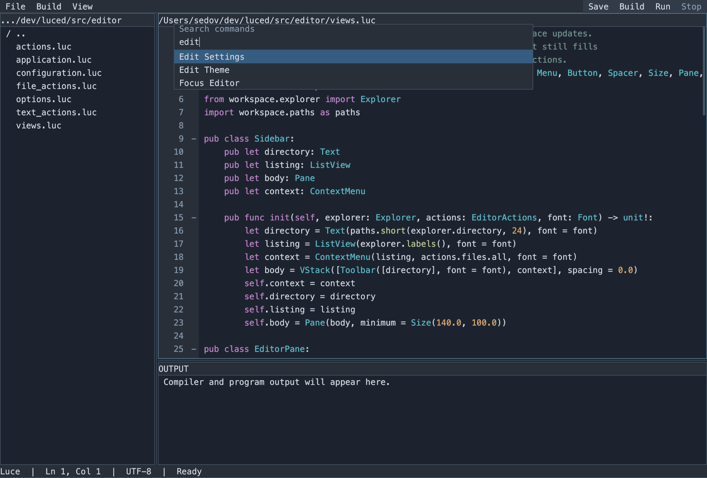

# Commands, context and user configuration

- [x] Extend luce-ui popups with context placement, text input and reusable
  command search / text prompts; preserve focus and modal event handling.
- [x] Add editor/output/explorer context menus and file creation, folder creation,
  cut/copy/paste, renaming and explicit deletion; keep filesystem policy in luced.
- [x] Make the explorer menu context sensitive, hover its rows, and toggle hidden files.
- [x] Give the folding gutter its own theme color and highlight the active pane.
- [x] Add user-wide `~/.luced/settings.toml` and `theme.toml`, validated loading,
  editable defaults, and reload commands without overwriting existing files.
- [x] Add Cmd/Ctrl+P command search, Edit Settings / Edit Theme, and F6/Shift+F6
  pane navigation using the same action objects as menus and shortcuts.
- [x] Test native and comparison modes, file operations and configuration errors;
  inspect actual rendered popups, document behavior, commit and push.

Reusable interaction and rendering belong in luce-ui. Luce editor components
own command meaning, open documents, filesystem changes and configuration schema.
OS home-directory resolution and filesystem primitives belong in luce-base.
Configuration uses the home directory, including the Windows user profile;
tests and preview captures use an isolated configuration directory.

## Interaction

`ContextMenu` decorates any widget. The layout tree routes a secondary click to
the closest context provider after the target has updated its selection. The
popup stays inside the window and takes keyboard input until it closes. The
originating pane retains its active border while a popup is open. Shift+F10 opens
the focused control's context menu without a pointer.

Luced supplies the actions and their availability:

| Area | Commands |
| --- | --- |
| Explorer (empty) | New File, New Folder, Paste, Show/Hide Hidden Files, Refresh Files |
| Explorer (folder) | New File, New Folder, Paste, Copy Path, Rename, Delete |
| Explorer (file) | Cut, Copy, Copy Path, Rename, Delete |
| Editor | Undo, Redo, Cut, Copy, Paste, Select All, Save, folding |
| Output | Copy Output Selection, Select All Output, Clear Output |
| Other application chrome | Command Palette, Edit Settings, Edit Theme, Edit AI Settings, Reload Configuration, pane navigation |

The explorer menu is context sensitive: the file pane picks its entries from the
selection the click just made, so files, folders and empty space each get their
own commands. A secondary click on an explorer row selects without opening it; a
click on empty space or the parent row selects nothing. A secondary click inside
selected text preserves the selection. Read-only output never enables destructive
editing commands. `TextPrompt` provides reusable name entry and explicit deletion
confirmation; Escape or Cancel leaves files alone.

Cut and Copy remember a source path; Paste copies it, or moves it for a Cut, into
the selected folder or the current directory, choosing the first unused
`name copy.ext` rather than overwriting. Copy operates on files, Cut on either.
Show Hidden Files toggles dot-prefixed entries; `.DS_Store` and `__pycache__`
stay hidden. File creation and rename refuse existing destinations. Renaming or
moving directories updates open descendant documents. Deletion refuses unsaved
open documents,
including descendants, and asks for confirmation before removing a directory's
contents. Filesystem failures appear in the status bar.

**New Tab** (Cmd+N) opens an empty untitled buffer in a tab, ready to type into.
Saving an untitled buffer prompts for a name and writes it into the current
explorer directory, then the tab adopts the new file. Save all skips untitled
buffers, since each needs its own destination.

**Toggle Word Wrap** (Cmd/Ctrl+Alt+Z) soft-wraps long lines to the pane width
instead of scrolling horizontally, and back. Wrapping breaks at word boundaries,
falling back to a hard break for a word wider than the pane; a wrapped line keeps
its indentation and shows its number only on the first visual row. The toggle
applies to every open editor and to tabs opened afterward; `editor.word_wrap`
sets the startup default.

`CommandPalette` searches the same action instances as menus and shortcuts.
Cmd+P on macOS, or Ctrl+P, opens it. Type words to filter, use arrows to select,
Enter to invoke and Escape to dismiss. Disabled commands remain visible but
cannot run. F6 and Shift+F6 cycle the explorer, editor and output; Cmd/Ctrl+1, 2
and 3 focus them directly. Cmd/Ctrl+Alt+arrows move to the nearest pane in that
direction, choosing the pane whose center is furthest along the arrow and least
off its axis, so a split editor and its neighbors stay one keystroke apart. The
focused pane has the `active_border` color.



## User files

The default directory is `$HOME/.luced` on macOS/Linux and
`%USERPROFILE%\.luced` on Windows. `--config-dir DIRECTORY` selects an isolated
profile. First launch creates missing files exclusively, preserving existing
files and comments. **Edit Settings** and **Edit Theme** open ordinary documents
with the same save and external-change protections as source files.

Default `settings.toml`:

```toml
[editor]
font_family = ""
font_size = 14.0
word_wrap = false

[window]
width = 1180
height = 800

[compiler]
luce = "luce"
luce_base = "luce-base"

[shortcuts]
new_tab = "cmd+n"
save = "cmd+s"
build = "cmd+b"
run = "f5"
toggle_word_wrap = "cmd+alt+z"
ask_ai = "cmd+i"
write_ai = "cmd+shift+i"
command_palette = "cmd+p"
focus_editor = "cmd+2"
focus_left = "cmd+alt+left"
focus_down = "cmd+alt+down"
```

An empty family uses the OS monospace face. Font sizes range from 8 to 40 points.
`word_wrap` starts new tabs with soft wrap on or off. Window width ranges from 480
to 4096 and height from 300 to 4096; dimensions must be whole numbers. `--luce` and
`--base` override compiler settings for that run.

`[shortcuts]` binds a command id to a key chord. A chord is `+`-separated and
case-insensitive: `cmd`/`ctrl`/`super` is the primary modifier, plus `shift` and
`alt`; the last token is the key (a letter, digit, `f1`..`f12`, a symbol like `[`,
or a named key like `enter`). `"none"` unbinds. A command absent from the table
keeps its built-in default; an unknown id is ignored. The command ids are those
shown in the palette — `new_tab`, `save`, `save_all`, `build`, `run`, `stop`, `fold`,
`fold_all`, `unfold_all`, `toggle_word_wrap`, `ask_ai`, `write_ai`, `spellcheck_ai`, `command_palette`, `next_pane`,
`previous_pane`, `focus_explorer`, `focus_editor`, `focus_output`, `focus_left`,
`focus_right`, `focus_up`, `focus_down`. Editing keys (undo, cut, copy, paste,
select all) are handled inside the text editor, not here.

`theme.toml` accepts these optional colors; omitted values use defaults:

| Table | Keys |
| --- | --- |
| `colors` | `background`, `panel`, `foreground`, `muted`, `selection`, `accent`, `button`, `pressed`, `border`, `active_border`, `gutter`, `shadow` |
| `syntax` | `keyword`, `string`, `comment`, `number`, `type`, `other` |

Colors are quoted sRGB `#RRGGBB` values. For example:

```toml
[colors]
gutter = "#282F39"
active_border = "#598199"

[syntax]
keyword = "#C48BD3"
```

Popup appearance also accepts a `[popup]` table:

```toml
[popup]
shadow_offset = 4.0
shadow_opacity = 0.35
```

The shadow is a sharp translated rectangle, with no blur. Offset accepts 0–32
logical points, opacity accepts 0–1, and zero disables the shadow. Existing theme
files need no edits: omitted keys use defaults. Add these keys to customize them.

Hover, focus and active-line highlights are derived from the palette, never
configured: each lifts a surface toward `foreground` in perceptual (Oklab)
lightness while keeping its hue, so a grayscale palette stays grayscale and a
tinted one stays in family. Keyboard focus uses `active_border` and takes
precedence. The caret's line-number row is a lift of `gutter`, including while a
menu is open.

Unsaved edits appear as gutter change bars against the file on disk: green for an
added line, blue for a modified line, and a red tick where lines were removed. The
bars track the buffer as you type and clear on save; the tab keeps its `*` dirty
marker independently.

Pane title bars share their frame's normal, hover and focus color. Inactive tabs
use `panel`; icons and titles share the configured foreground. Horizontal title
spacing is configurable in character cells:

```toml
[layout]
header_inset_cells = 1.5
caret_width = 2.0
```

`header_inset_cells` accepts 0–4 cells and follows the shared font's advance. Both
title and body retain the same font size; changing the font updates header and
icon geometry. `caret_width` sets the blinking text caret's thickness in points
(1–8, default 2).

`ai.toml` configures AI models and providers. **Edit AI Settings** opens it with
the same protections as the other files. It is created once and never rewritten,
holds no key by default, and — because it can hold API keys — is meant to stay
private:

```toml
[ask]
provider = "openrouter"
model    = "deepseek/deepseek-chat"
system   = "You are a concise coding assistant."

[write]
provider = "openrouter"
model    = "anthropic/claude-sonnet"
system   = ""

[spellcheck]
provider = "openrouter"
model    = "openai/gpt-4o-mini"

[inline]
provider = "claude_code"
model    = "sonnet"

[openrouter]
api_key  = ""                     # a literal key, or leave empty and use key_env
key_env  = "OPENROUTER_API_KEY"   # an environment variable holding the key
base_url = "https://openrouter.ai/api/v1"

[claude_code]
command = "claude"
```

Each mode — `ask`, `write`, `spellcheck`, `inline` — has a `provider` (default
`openrouter`), a `model` (the provider's own id, which may contain slashes), and an
optional `system` prompt. Every mode is optional. A mode naming an unknown
provider, or an unknown table or key, is an error like any other configuration
mistake. A key may be a literal `api_key` or the name of an environment variable in
`key_env`, read only when a request is made. Table headers are flat (`[openrouter]`),
since the reader accepts only bare table names.

**Ask AI** (Cmd/Ctrl+I) prompts for a question and sends it to the `ask` mode's
model; **AI Write** (Cmd/Ctrl+Shift+I) prompts for a change and uses the `write`
mode; **AI Spellcheck Selection** sends the selection to the `spellcheck` mode with
no prompt. Any selected text is included as context, so you can ask about or rewrite
a selection. Each request runs over a native HTTPS connection — no external tools —
with the mode's system prompt, on a background thread so the editor stays responsive;
the reply appears in the word-wrapped Output pane. Requests use OpenRouter (the
`claude_code` provider is not wired yet), so a mode needs a model and a credential,
or the command reports what to configure.

The application checks for changed contents every half second and validates the
files before applying them. Font changes update the shared `Font` object used by
every control. Theme-only changes retain its glyph cache. Syntax colors replace
decorations without changing document text, selection or history. Compiler
changes affect future commands; window dimensions apply on the next launch.
**Reload Configuration** explicitly retries the current files.

Malformed changes stay on disk with an error in the status bar, leaving the
applied configuration in place. Startup uses defaults for an invalid file and
reports the problem. The configuration layer never rewrites user files to repair
them. Each file is limited to 64 KiB.

## Supported TOML forms

This is a small configuration reader, not a complete general TOML library. It
implements the forms needed by these schemas from the
[TOML 1.0 specification](https://toml.io/en/v1.0.0): bare table/key names,
single-line basic or literal strings, decimal numbers, the booleans `true` and
`false`, and comments outside strings. UTF-8 text can be written directly. Basic
strings support `\\`, `\"`, `\n`, `\r` and `\t`; literal strings preserve
backslashes, useful for Windows paths such as `'C:\dev\luce\build\luce.exe'`.
Numbers support decimal fractions, exponents and underscores between digits.

Quoted/dotted keys, multiline strings, Unicode escapes, arrays, inline tables,
dates and non-decimal integers are outside the current schema and are
rejected. Duplicate keys/tables and unknown settings are errors rather than
silently ignored typos. Missing keys use their documented defaults.

## Validation

`tests/configuration.luc` exercises isolated user files, invalid settings and
themes, command search, Unicode file prompts, file collisions, directory renames,
unsaved-document deletion protection, reload and pane navigation. It runs with
the existing editor suite in native modes 0 and 2.

Luce-ui separately tests popup placement, selection, dismissal, Unicode input,
focus restoration, shared font reconfiguration and detached widget reattachment
in native modes 0–3 and C comparison builds. Metal readback checks render the
actual app and popups; CI retains the resulting frames. Base tests exclusive
file creation/copy/move and owned home-directory paths across native and C modes.
